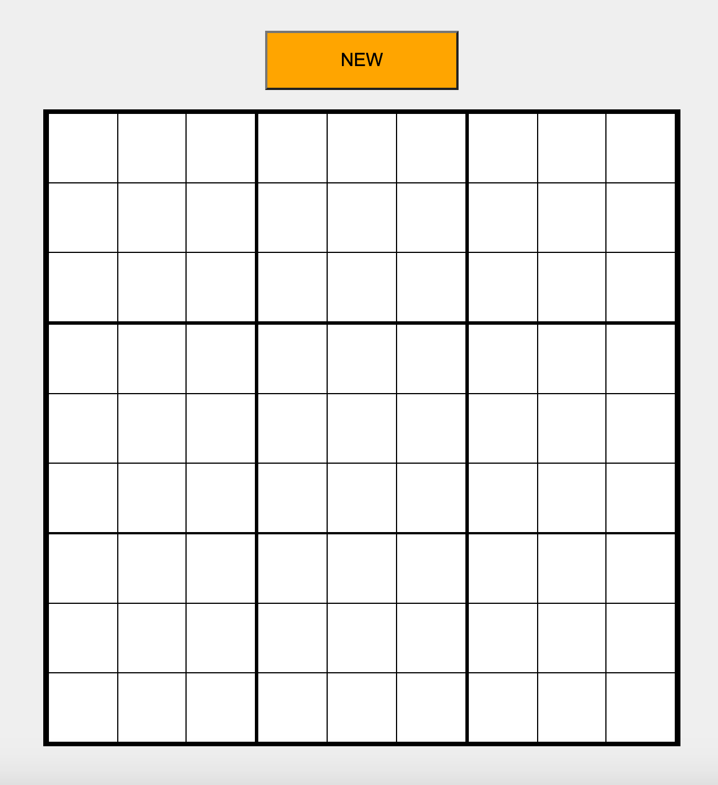
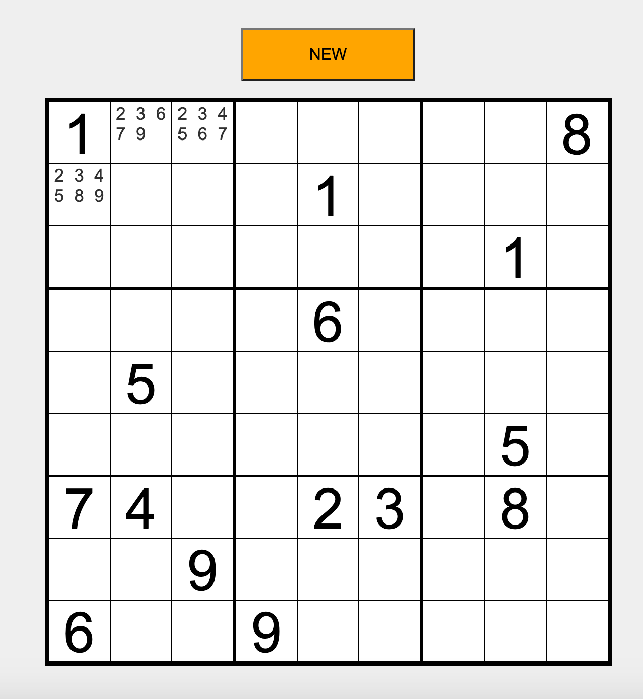
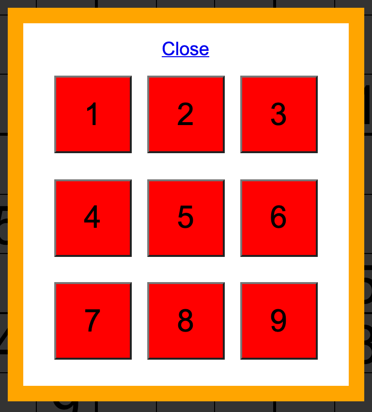
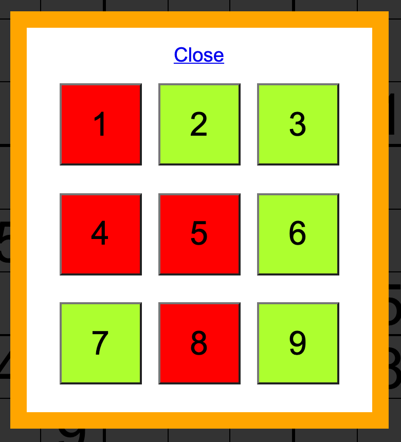

# Sudoku Builder

A website to allow people to enter and complete sudokus.

## Table of Contents
1. [General Info](#1-general-info)
2. [Website](#2-website)
3. [Technologies](#3-technologies)
4. [Features](#4-features)
5. [Status](#5-status)
6. [Inspiration](#6-inspiration)

## 1. General Info
The website allows the user to enter the numbers and possible mini numbers into each square of the 9x9 sudoku board.  The data is saved locally on the device allowing each person to be able to complete each puzzle at their own pace.

## 2. Website
__Link:__ [Sudoku Builder](http://sudokubuilder.epizy.com/)

## 3. Technologies
- HTML5 & CSS
- JavaScript

## 4. Features
- Click a square to display value selector popup
- Enter a number into a square by selecting only one number from the Value Selector popup
- Enter note numbers into a square by selecting multiple numbers from the Value Selector popup
- Save current sudoku status locally on device
- Create a brand new sudoku board by clicking the New button

### To do:
- Undo/Redo buttons
- Allow one note number to be input

__Sudoku Board__

    
    &nbsp; &nbsp; &nbsp;
    

New 9x9 sudoku (left) and ongoing sudoku with multiple numbers and possible note numbers (right)

 
 

__Square Value Selector__

    
    &nbsp; &nbsp; &nbsp;
    

No numbers selected (left) and multiple numbers selected (right)

## 5. Status
This project is ongoing.

## 6. Inspiration
I decided to create this after noticing my dad having to redraw a sudoku onto a piece of paper, because there wasn't enough room to write all the possible numbers in each square.  As well, I made this project solely using JavaScript to practice and improve my knowledge. 
